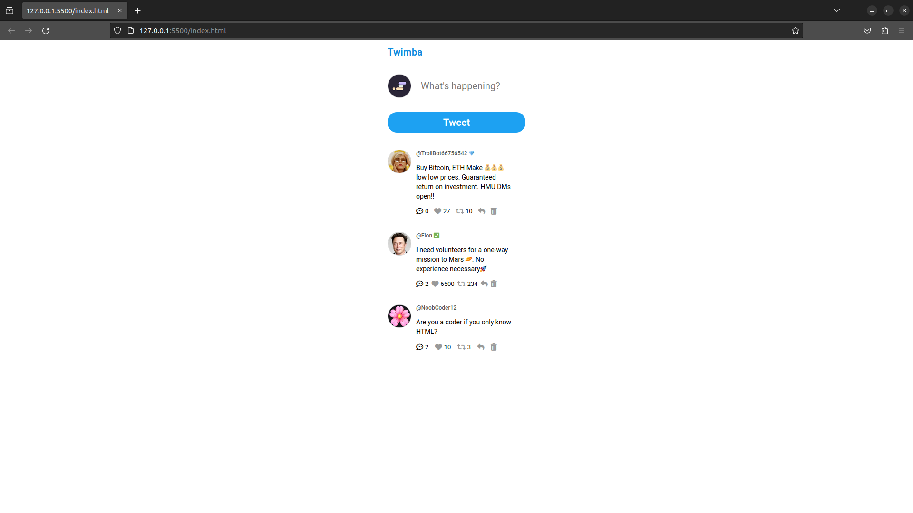

# Twimba

A simple Twitter-like web application where users can post tweets, like, retweet, and reply to tweets.



## Table of Contents

- [Features](#features)
- [Installation](#installation)
- [Usage](#usage)
- [Contributing](#contributing)

## Features

- **Tweeting:** Users can post tweets with their handle, profile picture, and tweet text.
- **Interactions:** Users can like, retweet, and reply to tweets.
- **Dynamic UI:** Real-time updates to the UI when interactions occur.
- **Delete Tweets:** Users can delete their tweets.

## Installation

1. **Clone the repository:**

   ```bash
   git clone https://github.com/AbhayPratap10/twimba.git
   ```

2. **Navigate to the project directory:**

   ```bash
   cd twimba
   ```

3. **Open the `index.html` file in your preferred web browser.**

## Usage

1. **Tweeting:**
   - Enter your tweet in the input field.
   - Click the "Tweet" button to post.

2. **Interactions:**
   - Click the heart icon to like a tweet.
   - Click the retweet icon to retweet a tweet.
   - Click the speech bubble icon to view and add replies.

3. **Deleting Tweets:**
   - Click the trash can icon to delete your tweet.

## Contributing

Contributions are not currently accepted for this project as it serves as a static mockup.